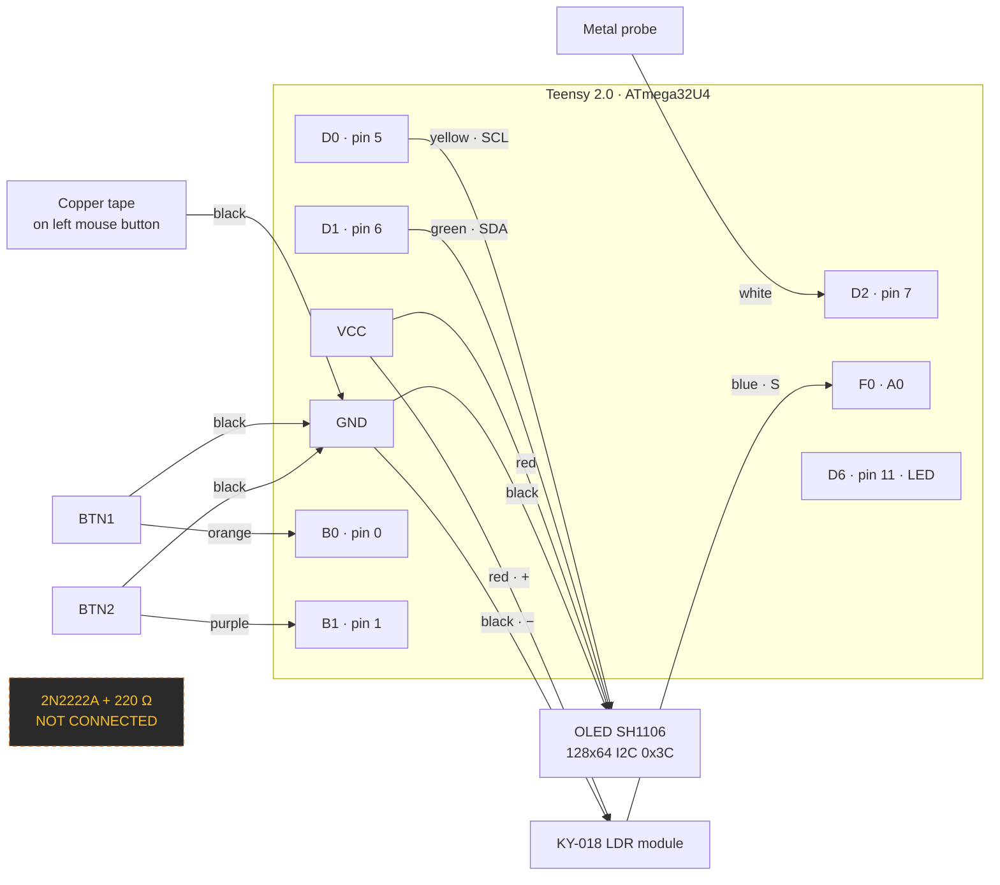

# Latency Tester

Microsecond-accurate mouse click latency measurement with a Teensy 2.0, plus a
desktop dashboard for running, archiving and comparing benchmarks.

**Software v3.0.0 · Firmware v1.4 · Serial protocol v1**

[](https://github.com/PrimeBuild-pc/MouseLatencyTester/actions/workflows/tests.yml)
[](https://github.com/PrimeBuild-pc/MouseLatencyTester/actions/workflows/codeql.yml)
[](LICENSE)


---

## What this actually measures

A metal probe is clamped so that it touches a strip of copper tape on the mouse
button at the exact instant the switch actuates. That contact closure is **t₀**,
taken inside an interrupt on the Teensy. The mouse then sends its HID report,
Windows delivers the click, and the dashboard answers the Teensy — **t₁**. The
calibrated serial round-trip is subtracted from `t₁ − t₀`.

The result covers switch debounce, the mouse's internal processing, the
wireless or USB link, the polling interval and the OS input stack. It does
**not** cover display or render latency.

## Feature maturity — read this first

| | Feature | Status |
|---|---|---|
| 1 | **Probe method** — the measurement described above | ✅ **Working and verified on real hardware.** Every number the app produces comes from this path |
| 2 | **OLED SH1106** | ✅ Working. Frozen during test mode so I²C traffic cannot disturb the timing |
| 3 | **KY-018 light sensor** | ✅ Working, but **telemetry only**. The `LIGHT` value is recorded with each run and displayed. It plays no part in any measurement |
| 4 | **BTN1 / BTN2 physical buttons** | 🧪 **Wired, firmware v1.4, test phase.** Each press emits exactly one `BTN1:PRESS` / `BTN2:PRESS`, which the dashboard counts and logs. **No action is bound to them yet** — see [Button bring-up](#9-buttons--btn1--btn2) |
| 5 | 2N2222A transistor + 220 Ω resistor | ⛔ **Not connected, not supported.** Their purpose has not been specified. Nothing in this repository anticipates them |
| 6 | Photoresistor / click-to-photon measurement mode | ⛔ Does not exist and is not being faked. Awaiting a separate specification |

Rows 5–6 are not implemented and no wiring for them is documented, on purpose.

---

## Install

### Windows installer (recommended)

Download **`LatencyTester-<version>-Setup.exe`** from the
[latest release](https://github.com/PrimeBuild-pc/MouseLatencyTester/releases/latest).

It installs the dashboard, **the firmware sketches** and the full documentation
into one folder, so you can flash the Teensy without cloning anything. No admin
rights are required by default, and your measurement archive lives outside the
install directory and is never touched by the uninstaller.

The installer is not code-signed, so Windows SmartScreen will warn on first run
— verify the `SHA256SUMS.txt` published with the release.

### From source

```powershell
pip install -r requirements.txt
python run_dashboard.py
```

### No hardware?

**Settings → Demo mode → Start demo device.** The whole interface, the charts
and the archive work against a simulator that speaks the real protocol; runs
recorded that way are flagged `[DEMO]` and never mixed with real measurements.

### Languages

English · Italiano · Deutsch · Español · Français · 日本語 · Русский · 中文

Switch under *Settings → Language*; the choice persists. Adding another one is
a single JSON file — see [CONTRIBUTING.md](CONTRIBUTING.md#adding-a-language).

Full guides: [Installation](docs/installation_windows.md) ·
[Flashing](docs/flashing_teensy.md) · [Bring-up & electrical notes](docs/wiring.md) ·
[First measurement](docs/first_test.md) ·
[Troubleshooting](docs/troubleshooting.md) ·
[Serial protocol](docs/serial_protocol.md)

---

# Hardware

Everything in this section describes the **build that is physically assembled
and verified**, so it can be reproduced without any prior context.

## BOM / parts list

| Qty | Component | Function | Notes |
|:--:|---|---|---|
| 1 | **Teensy 2.0** (ATmega32U4, 16 MHz) | Takes t₀ in an ISR, computes latency, talks to the PC | The whole measurement lives here |
| 1 | **OLED 1.30", 128×64, SH1106, I²C, 4-pin** | Local status display | Address `0x3C`, confirmed with an I²C scanner. **One** display, see note below |
| 1 | **KY-018 photoresistor module** | `LIGHT` telemetry recorded with each run | Analog output. Not part of the measurement |
| 2 | **Momentary push buttons** | `BTN1` / `BTN2` events | No external resistors — `INPUT_PULLUP` is used |
| 1 | **Breadboard** (400 or 830 points) | Power rails and module mounting | |
| 1 | **Conductive copper tape**, 5 mm | Contact pad on the mouse button | Aluminium foil + tape works too |
| 1 | **Metal probe / multimeter tip** | Closes the circuit at the instant of the click | A stiff bare wire also works |
| 1 | **Helping hands / third hand** | Holds the probe steady | Not optional in practice — probe alignment is the biggest error source |
| — | **Jumper wires M-M and M-F** | Wiring | Both types needed |
| — | **Solid-core wire** | Short, tidy breadboard runs | |
| — | **Soldering iron + solder** | Permanent joints on the probe and tape | |
| — | **Insulating tape** | Strain relief and shorts prevention | |
| 1 | **Micro USB cable** | Power and serial | A data cable, not charge-only |
| 1 | 2N2222A NPN transistor | — | ⛔ **Present but NOT connected and NOT supported by the firmware** |
| 1 | 220 Ω resistor | — | ⛔ **Present but NOT connected** |

> **Note on the OLED count.** An earlier version of this project's parts list
> mentioned *two* OLED displays as a future upgrade. **The validated build uses
> exactly one.** A second display is not required and is not supported by the
> firmware.

Measured on USB power: **≈ 4.8 V** between `VCC` and `GND` at the breadboard
rails.

## Wiring — pin by pin

| Component | Component pin | Teensy pad | Arduino pin | Wire colour | Function |
|---|---|:--:|:--:|---|---|
| Breadboard rail | + | `VCC` | — | 🔴 Red | Power to OLED and KY-018 (~4.8 V on USB) |
| Breadboard rail | − | `GND` | — | ⚫ Black | Common ground for everything |
| Probe | tip | `D2` | **7** | ⚪ White | Probe input, `INPUT_PULLUP`, trigger on `FALLING` |
| Copper tape | on left mouse button | `GND` | — | ⚫ Black | Return path — closing to GND is the t₀ event |
| OLED SH1106 | `GND` | `GND` | — | ⚫ Black | Ground |
| OLED SH1106 | `VCC` / `VDD` | `VCC` | — | 🔴 Red | Power |
| OLED SH1106 | `SCL` / `SCK` | `D0` | **5** | 🟡 Yellow | I²C clock |
| OLED SH1106 | `SDA` | `D1` | **6** | 🟢 Green | I²C data |
| KY-018 | `S` | `F0` | **A0** | 🔵 Blue | Analog light level, 0–1023 |
| KY-018 | `+` | `VCC` | — | 🔴 Red | Power |
| KY-018 | `−` | `GND` | — | ⚫ Black | Ground |
| BTN1 | leg A | `B0` | **0** | 🟠 Orange | Button input, `INPUT_PULLUP` |
| BTN1 | leg B | `GND` | — | ⚫ Black | Pressed = LOW |
| BTN2 | leg A | `B1` | **1** | 🟣 Purple | Button input, `INPUT_PULLUP` |
| BTN2 | leg B | `GND` | — | ⚫ Black | Pressed = LOW |
| Built-in LED | — | `D6` | **11** | — | Lit while a measurement is pending |

> **KY-018 pin order.** Always follow the `S` / `+` / `−` markings silkscreened
> on the module. **Do not infer the order from the physical pin positions** —
> it varies between manufacturers.

> **`A0` on a Teensy 2.0** resolves to pad `F0` (digital 21) in Teensyduino.
> That is why the sketch's `analogRead(A0)` reads the pad labelled `F0`.

## Wire colour convention

| Colour | Use |
|---|---|
| ⚫ Black | GND |
| 🔴 Red | VCC / ≈ 5 V |
| 🟡 Yellow | OLED `SCL` |
| 🟢 Green | OLED `SDA` |
| 🔵 Blue | KY-018 analog signal |
| ⚪ White | Probe |
| 🟠 Orange | BTN1 |
| 🟣 Purple | BTN2 |

**These colours are a project convention for readability, not an electrical
requirement.** Any colour works electrically; keeping to the table makes the
photos, the diagrams and the physical build agree with each other.

## Diagram

```text
                    TEENSY 2.0  (ATmega32U4, 16 MHz)
                  +--------------------------------+
   metal probe ---|  D2   (7)   probe in    [WHT]  |
        :         |                                |
        :         |  D0   (5)   I2C SCL     [YEL] -+--------> OLED SCL
        :         |  D1   (6)   I2C SDA     [GRN] -+--------> OLED SDA
        :         |                                |
        :         |  F0   (A0)  analog in   [BLU] <+--------- KY-018  S
        :         |                                |
        :         |  B0   (0)   BTN1 in     [ORG] <+--------- BTN1 --+
        :         |  B1   (1)   BTN2 in     [PUR] <+--------- BTN2 --+
        :         |                                |                 |
        :         |  D6   (11)  built-in LED       |                 |
        :         |                                |                 |
        :         |  VCC                    [RED] -+---+--> OLED VCC |
        :         |  GND                    [BLK] -+-+ +--> KY-018 + |
        :         +--------------------------------+ |               |
        :                                            |               |
        v                                            +--> OLED GND   |
  +------------------------+                         +--> KY-018 -   |
  |  copper tape on the    |                         +---------------+
  |  LEFT mouse button     |---------[BLK]-----------+  (BTN1/BTN2 other leg)
  +------------------------+
                                    GND rail

  The probe touches the tape at the exact instant the switch actuates -> t0.

  Colour codes: BLK=GND  RED=VCC  YEL=SCL  GRN=SDA
                BLU=KY-018 signal  WHT=probe  ORG=BTN1  PUR=BTN2

  NOT CONNECTED: 2N2222A transistor, 220 ohm resistor.
```



The 2N2222A and its resistor appear in the diagram only to record that they
exist and are **deliberately unconnected**. No connection for them is invented
here.

## Bring-up — test in this order

Each step must pass before moving to the next. Expected results are what you
should actually see.

| # | Step | Expected result |
|:--:|---|---|
| 1 | **Teensy alone.** Flash the sketch, open the Serial Monitor at 115200 | `LATENCY_TESTER v1.4 OLED+LDR+BTN` then `READY`. The board enumerates as a COM port |
| 2 | **Probe.** Touch the probe to the copper tape | `TRIG` appears. The pin-11 LED lights while the measurement is pending. With no dashboard running you then get `TIMEOUT:...` — that is correct |
| 3 | **OLED I²C scan.** Run an I²C scanner sketch | Exactly one device found at `0x3C` |
| 4 | **OLED display test.** Flash `firmware/displayTester/` | Text on the panel; the main sketch prints `OLED_OK:0x3C` instead of `OLED_FAIL` |
| 5 | **KY-018 analog read.** Send `L` | `LIGHT:<value>`. Covered ≈ **0–20**; evening room light ≈ **150–250**; phone torch ≈ **1000**. Verify `+`/`−` with a multimeter |
| 6 | **Probe + OLED + KY-018 together** | Probe still triggers; the display refreshes about twice a second; `LIGHT` tracks the room. Occasional `SKIP:OLED_REFRESH` outside test mode is normal and correct |
| 7 | **Calibration.** Dashboard → *Calibrate* | `CALIB_OK:<offset>,samples:...`. The offset lands near 250 µs — see the [known quirk](docs/serial_protocol.md#6-calibration-sequence) |
| 8 | **Test mode.** Dashboard → *ENTER TEST MODE* | Full-screen overlay; `TESTMODE:ON`; the OLED freezes; green ⇄ red tracks `ARMED` / `REARM`; blue at the target |
| 9 | **BTN1 / BTN2** | See below — 10 presses must give exactly 10 events |
| 10 | Transistor / light-sensing mode | ⛔ Not defined yet. Do not wire the 2N2222A |

### 9. Buttons — BTN1 / BTN2

Firmware v1.4 is a **test phase**. The buttons are polled in `loop()` with a
non-blocking 30 ms `millis()` debounce — never on an interrupt, and never
printing anything between t₀ and t₁. They currently change no firmware state.

Flash v1.4, open the dashboard and press **BTN1 ten times, slowly**:

```text
BTN1:PRESS
```

Then the same with **BTN2**:

```text
BTN2:PRESS
```

The *Controls* panel on the Live test tab shows a live `BTN1` / `BTN2` counter
so the totals are readable without scrolling the log.

Pass criteria:

* 10 presses of BTN1 → **exactly 10** `BTN1:PRESS`
* 10 presses of BTN2 → **exactly 10** `BTN2:PRESS`
* no phantom events while idle
* no double events from one press
* holding a button down does **not** repeat
* normal mouse measurement still works

Only after that passes do the buttons get real behaviour: **BTN1 = request
enter/exit test mode**, **BTN2 = reset the live run while *not* in test mode**.
The dashboard stays the authority on session state — the firmware only reports
the event. Long presses, double clicks and combinations are out of scope.

## Electrical notes

* **Disconnect USB before soldering.** No exceptions.
* **Never connect VCC directly to the probe signal.** The probe pin is an input
  with an internal pull-up; it expects to be shorted to **GND**, nothing else.
* **All modules share a common GND.** The Teensy, the OLED, the KY-018 and both
  buttons must sit on the same ground rail or nothing reads correctly.
* **Follow the printed `S` / `+` / `−` labels on the KY-018.** Do not deduce the
  order from pin position.
* **No external resistors on the buttons.** `INPUT_PULLUP` provides them.
  Adding pull-downs will break the logic.
* **Do not assume the 2N2222A pinout.** EBC and ECB orderings both exist
  depending on package and manufacturer. Identify the exact part before wiring
  it — and it is not to be wired yet regardless.
* USB power measured ≈ 4.8 V. The OLED and KY-018 are both fine at that level.

---

## The dashboard

**Live test** — the running measurement, with mean, median, min, max, standard
deviation, P5/P95/P99, IQR, MAD and jitter (P95−P5), a live chart with outliers
ringed, the full run configuration, and `BTN1`/`BTN2` press counters.

**Sessions** — every saved run, searchable. Rename, edit metadata, duplicate as
a template for the next configuration, export to CSV, delete.

**Compare** — several runs at once as raw samples, box plot, ECDF or histogram,
with a selectable baseline and Δ median / Δ mean / Δ P95 / Δ P99 in both
milliseconds and percent. Charts export to PNG, SVG or PDF.

**Devices** — profiles for each mouse: name, manufacturer, model, serial,
switch type, usual firmware, notes.

**Settings** — eight interface languages, light / dark / system theme, archive
backup, demo mode. Both preferences persist.

**Test mode** — full screen, colour-coded: 🟩 press · 🟥 wait · 🟦 done. The
OLED is frozen while it runs so the display never disturbs the timing.

### Raw data is never discarded

Outliers are detected with the Tukey fence and **marked** on the chart. They
stay in the database, in the CSV export and in every statistic. Deciding what
an outlier means is the operator's job.

---

## A typical session

```
Razer Viper → 1000 Hz → 50 samples → Save → New run
Razer Viper → 2000 Hz → 50 samples → Save → New run
Razer Viper → 4000 Hz → 50 samples → Save → New run
Razer Viper → 8000 Hz → 50 samples → Save
→ Compare, baseline = 1000 Hz
```

All without restarting the program.

---

## Repository layout

```
latency_tester/          the dashboard, as a package
  protocol.py            wire format: tokens, parsing        (no GUI, no serial)
  stats.py               percentiles, MAD, outliers, deltas  (pure functions)
  database.py            SQLite archive + schema migrations
  serial_service.py      reader thread, TRIG/click association
  demo.py                simulated Teensy
  settings.py            persisted preferences
  i18n.py                Italian + English
  theme.py               light / dark / system palettes
  widgets.py             tooltips, metric cards, live chart
  export.py              CSV
  app.py                 shell, state, event pump
  locales/               one JSON file per language
  views/                 live · sessions · compare · devices · preferences · testmode
firmware/                Arduino sketches, v1.0 → v1.4
packaging/               PyInstaller spec, Inno Setup script, build script
tests/                   pytest suite
docs/                    protocol, install, bring-up, first test, troubleshooting
legacy/                  the previous single-file dashboards, still runnable
```

The measurement and serial logic does not import tkinter, which is why it can
be tested without a display.

## Firmware versions

| Sketch | Notes |
|---|---|
| `latency_tester/` | v1.0 — probe only |
| `latency_tester_oled_ldr/` | v1.1 — adds OLED + KY-018 |
| `latency_tester_oled_ldr_v1_2/` | v1.2 — adds `SKIP:OLED_REFRESH` |
| `latency_tester_oled_ldr_v1_3/` | v1.3 — debounce/re-arm, test mode, OLED freeze. **Measurement baseline** |
| **`latency_tester_oled_ldr_v1_4/`** | **v1.4 — current. v1.3 plus BTN1/BTN2 test events. The measurement path is byte-identical to v1.3** |
| `displayTester/` | Standalone OLED check |

Older sketches still work with this dashboard; unknown tokens are logged, never
dropped. See the compatibility table in
[docs/serial_protocol.md](docs/serial_protocol.md).

## Development

```powershell
python -m pytest tests -q
```

110 tests cover protocol parsing (including the button tokens), the firmware
button-debounce rules, statistics and percentiles, the database and its
migration from the v2 schema, run save/load/duplicate, settings, i18n, the
TRIG↔click association rules and the demo device. Tkinter is deliberately not
pixel-tested.

`tests/test_button_debounce.py` mirrors `serviceButtons()` /
`flushButtonEvents()` from the v1.4 sketch line for line, so the bench
acceptance rules — ten presses give ten events, a held button never repeats,
nothing is transmitted between t₀ and t₁ — are checked in CI. It is a mirror,
not an import: if the `.ino` changes, change the test too.

Adding a language: add one entry to `TRANSLATIONS` in `latency_tester/i18n.py`.
A test enforces that every language defines the same key set.

## Data

Archive and preferences live in `~/Documents/LatencyTester/`, or wherever
`LATENCY_TESTER_HOME` points. The database is migrated in place and **never**
recreated or dropped; *Settings → Back up the archive* makes a consistent copy.

## Building the installer yourself

```powershell
powershell -ExecutionPolicy Bypass -File packaginguild_installer.ps1
```

Requires [Inno Setup 6](https://jrsoftware.org/isdl.php). The script runs the
test suite first and refuses to build if anything fails, then emits the
installer and its SHA-256 into `build\installer\`.

## Contributing

Pull requests are welcome. [CONTRIBUTING.md](CONTRIBUTING.md) covers the setup,
the testing rules and how to add a language — the last of which needs no Python
at all and is the easiest place to start.

One rule matters above the others: **changes to the measurement pipeline need
before/after numbers**, not opinions. Everything else is fair game.

Security issues go through [private reporting](https://github.com/PrimeBuild-pc/MouseLatencyTester/security/advisories/new),
never a public issue — see [SECURITY.md](SECURITY.md).

## Privacy

No telemetry, no network code, no auto-update. Every measurement stays in a
local SQLite file under your Documents folder.

## Licence

[MIT](LICENSE) © 2026 PrimeBuild.

## Credits

Built around a Teensy 2.0 (PJRC), with `pyserial`, `pynput` and `matplotlib`.
