<div align="center">


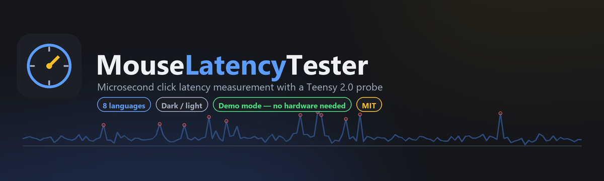

<br>

<a href="https://github.com/PrimeBuild-pc/MouseLatencyTester/commits/main"></a>
<a href="https://github.com/PrimeBuild-pc/MouseLatencyTester/stargazers"></a>
<a href="https://github.com/PrimeBuild-pc/MouseLatencyTester/issues"></a>

<a href="https://github.com/PrimeBuild-pc/MouseLatencyTester/releases/latest"></a>
<a href="https://github.com/PrimeBuild-pc/MouseLatencyTester/releases"></a>
<a href="https://github.com/PrimeBuild-pc/MouseLatencyTester/actions/workflows/tests.yml"></a>
<a href="https://github.com/PrimeBuild-pc/MouseLatencyTester/actions/workflows/codeql.yml"></a>
<a href="LICENSE"></a>

<a href="pyproject.toml"></a>
<a href="docs/installation_windows.md"></a>
<a href="#languages"></a>
<a href="firmware"></a>
<a href="#hardware"></a>

<br>

**Measure how long your mouse actually takes to click — to the microsecond.**

A Teensy 2.0 watches a probe touch the switch, the dashboard watches Windows report the click,<br>
and the difference is your real input latency. Archive it, chart it, compare it.

<br>

<a href="https://github.com/PrimeBuild-pc/MouseLatencyTester/releases/latest">

</a>

<sub>No hardware yet? The app ships a built-in simulator — <b>Settings → Demo mode</b>.</sub>

</div>

<br>

---

## Gallery

<div align="center">

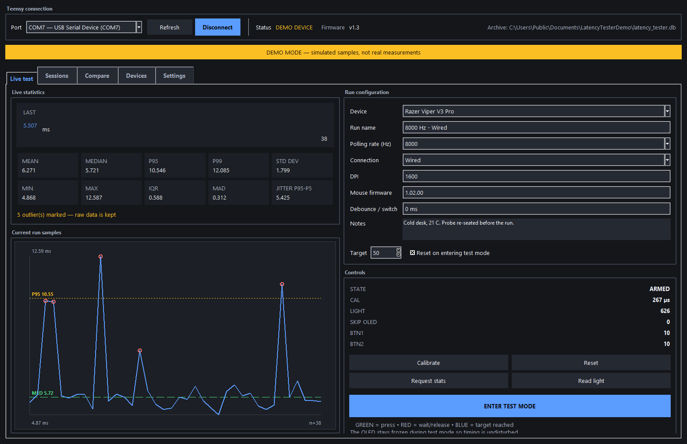

<sub><b>Live test</b> — mean, median, P5/P95/P99, IQR, MAD and jitter, with outliers ringed on the chart.</sub>

</div>

<br>

<table>
<tr>
<td width="50%" align="center">
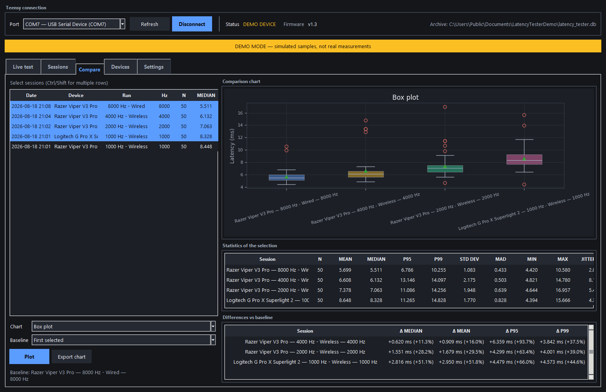<br>
<sub><b>Compare</b> — box plot with baseline deltas in ms and %</sub>
</td>
<td width="50%" align="center">
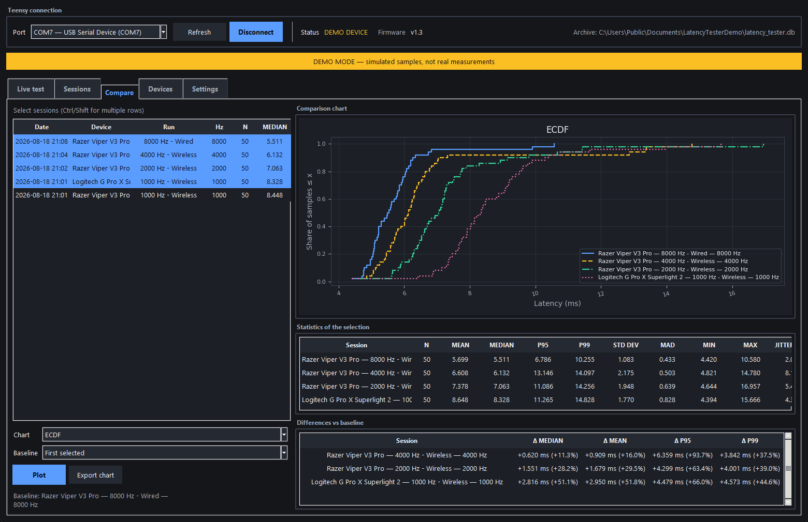<br>
<sub><b>ECDF</b> — where the slow clicks actually live</sub>
</td>
</tr>
<tr>
<td width="50%" align="center">
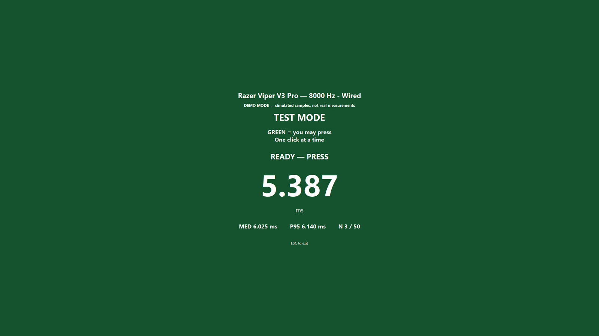<br>
<sub><b>Test mode</b> — 🟩 armed, press now</sub>
</td>
<td width="50%" align="center">
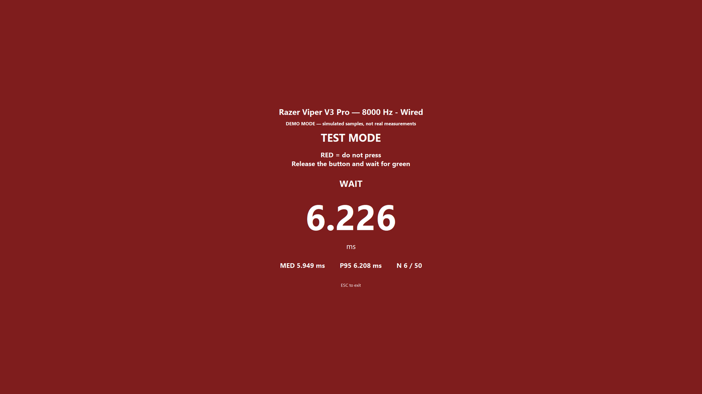<br>
<sub><b>Test mode</b> — 🟥 wait / release</sub>
</td>
</tr>
</table>

<details>
<summary><b>More screenshots</b> — light theme, sessions, devices, settings, raw samples, histogram</summary>
<br>
<table>
<tr>
<td width="50%" align="center">
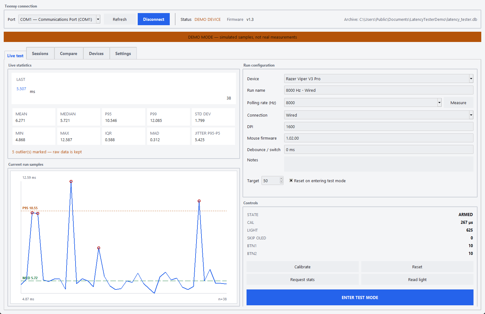<br>
<sub>Live test — light theme</sub>
</td>
<td width="50%" align="center">
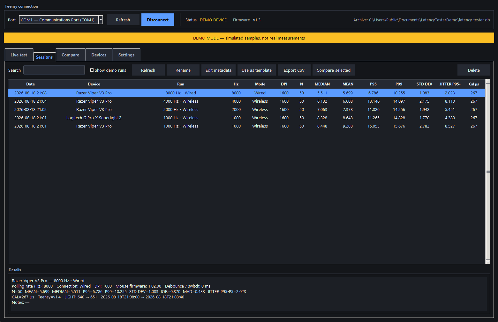<br>
<sub>Sessions — searchable archive</sub>
</td>
</tr>
<tr>
<td width="50%" align="center">
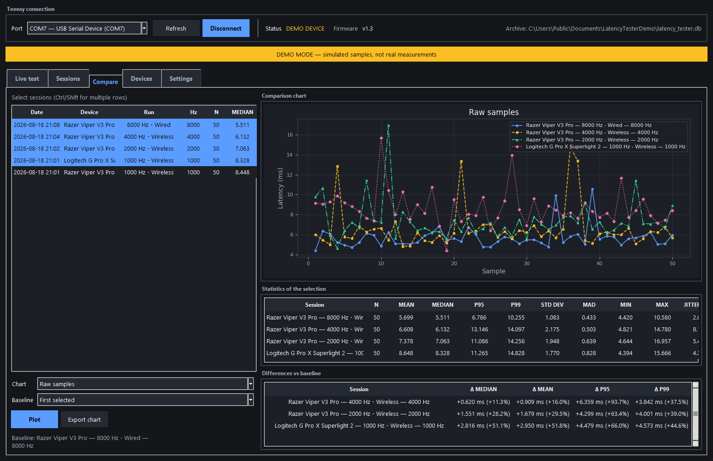<br>
<sub>Compare — raw samples</sub>
</td>
<td width="50%" align="center">
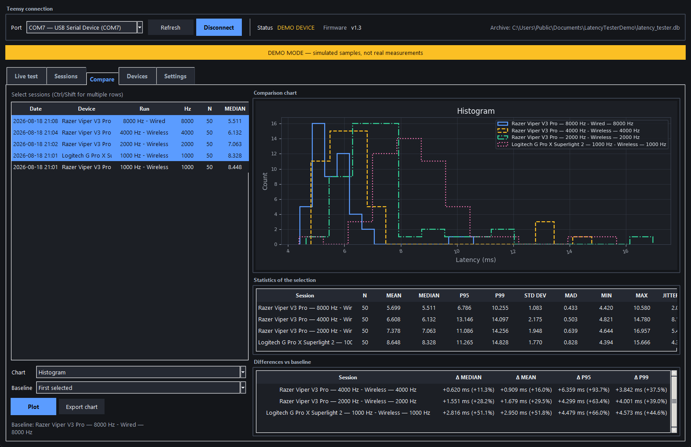<br>
<sub>Compare — histogram</sub>
</td>
</tr>
<tr>
<td width="50%" align="center">
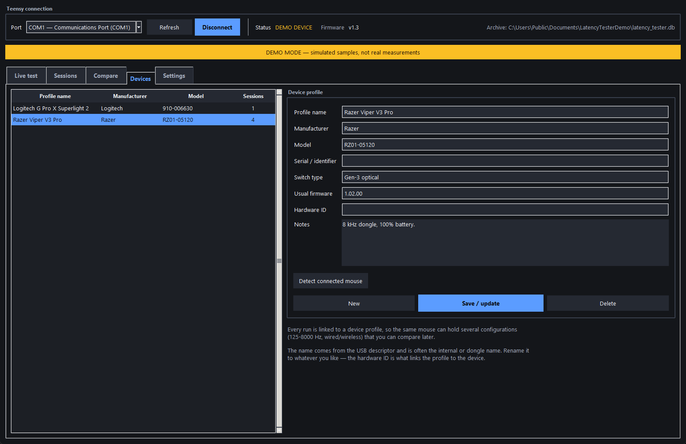<br>
<sub>Devices — one profile per mouse</sub>
</td>
<td width="50%" align="center">
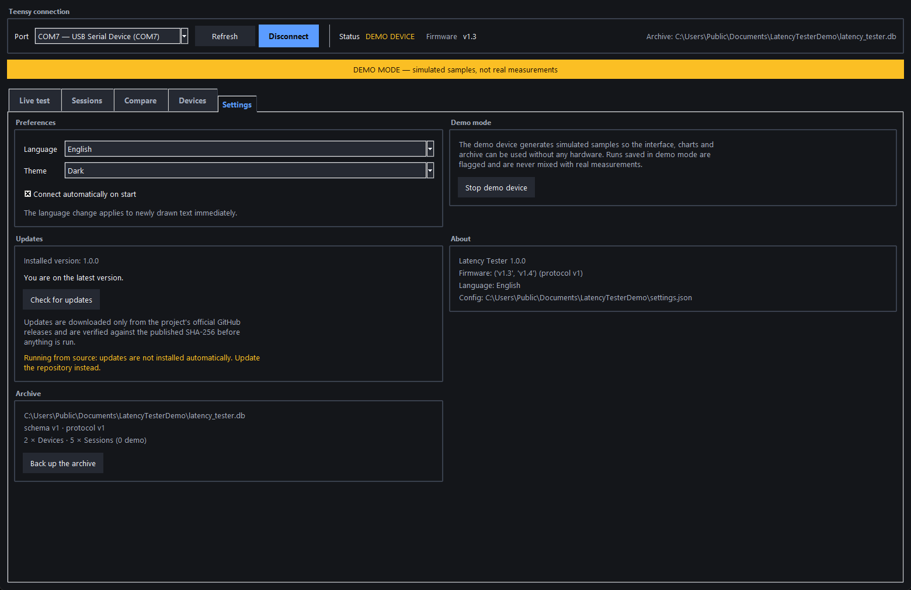<br>
<sub>Settings — theme, language, one-click update</sub>
</td>
</tr>
<tr>
<td colspan="2" align="center">
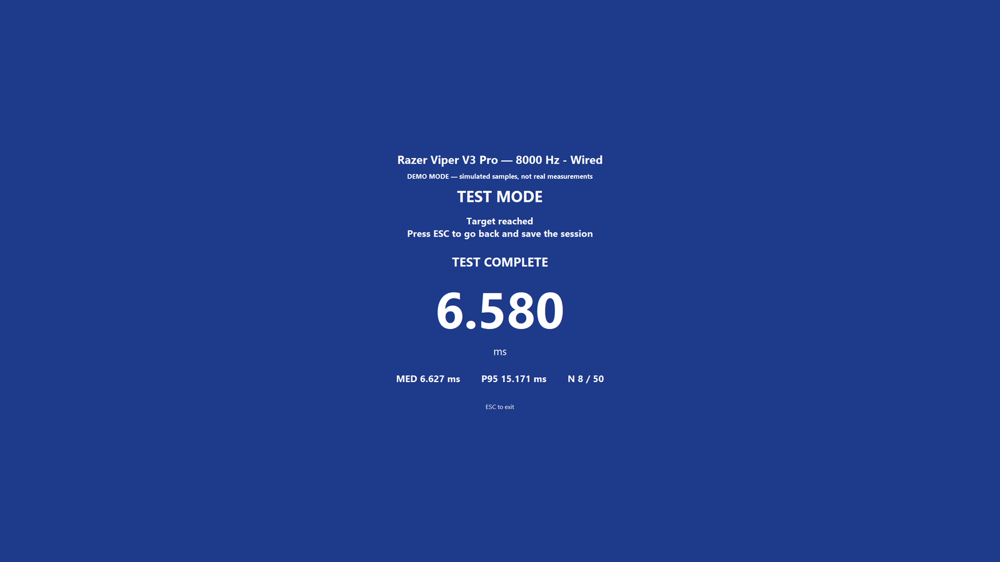<br>
<sub>Test mode — 🟦 target reached</sub>
</td>
</tr>
</table>
</details>

<sub>Screenshots are taken in demo mode, which is why they carry the simulated-data banner.</sub>

---

## What this actually measures

A metal probe is clamped so that it touches a strip of copper tape on the mouse button at the exact
instant the switch actuates. That contact closure is **t₀**, taken inside an interrupt on the Teensy.
The mouse then sends its HID report, Windows delivers the click, and the dashboard answers the
Teensy — **t₁**. The calibrated serial round-trip is subtracted from `t₁ − t₀`.

The result covers switch debounce, the mouse's internal processing, the wireless or USB link, the
polling interval and the OS input stack. It does **not** cover display or render latency.

> [!IMPORTANT]
> **The method is completely non-invasive.** The mouse is never opened, nothing is soldered to its
> PCB, and no transistor is wired across its microswitch. The only mouse-side modification is a
> strip of **removable** conductive copper tape on the outside of the left button. Peel it off and
> the mouse is exactly as it was.

### Feature maturity — read this first

| | Feature | Status |
|---|---|---|
| 1 | **Probe method** — the measurement above | ✅ **Working and verified on real hardware.** Every number the app produces comes from this path |
| 2 | **OLED SH1106** | ✅ Working. Frozen during test mode so I²C traffic cannot disturb the timing |
| 3 | **KY-018 light sensor** | ✅ Working, but **telemetry only**. Recorded with each run; it plays no part in any measurement |
| 4 | **BTN1 / BTN2 buttons** | ✅ **Working. 10/10 acceptance test passed on hardware.** BTN1 enters/leaves test mode, BTN2 clears the live run outside test mode. Presses are still counted and logged |
| 5 | **Probe-to-Photon mode** | 🧪 **Implemented, firmware v1.5.** Separate mode, own calibration, own metric. Accuracy is limited by the KY-018 — [read this](#probe-to-photon) before quoting a number |
| 6 | 2N2222A transistor + 4 × 220 Ω | 🚫 **Unused / reserved.** Not used by the current validated build: not connected, no firmware, no protocol |

Row 6 is not wired on purpose. Row 5 needed no new wiring: the KY-018 was already on `A0` and the
probe was already on `D2`.

---

## Install

<table>
<tr>
<td width="55%" valign="top">

### Windows installer &nbsp;<sub>recommended</sub>

Grab **`LatencyTester-<version>-Setup.exe`** from the
[latest release](https://github.com/PrimeBuild-pc/MouseLatencyTester/releases/latest).

It installs the dashboard, **the firmware sketches** and the full documentation
into a single folder, so you can flash the Teensy without cloning anything.

- Per-user install by default — **no admin rights needed**
- Your archive lives in `Documents\LatencyTester\` and is **never** touched by the uninstaller
- Built-in **one-click updater**: *Settings → Check for updates*

<sub>The installer is not code-signed, so SmartScreen warns on first run.
Verify <code>SHA256SUMS.txt</code> from the release.</sub>

</td>
<td width="45%" valign="top">

### From source

```powershell
git clone https://github.com/PrimeBuild-pc/MouseLatencyTester.git
cd MouseLatencyTester
pip install -r requirements.txt
python run_dashboard.py
```

### No hardware?

**Settings → Demo mode → Start demo device.**

A simulator that speaks the real serial protocol drives the whole interface,
the charts and the archive. Runs saved that way are flagged `[DEMO]` and never
mixed with real measurements.

</td>
</tr>
</table>

### Languages

<div align="center">

🇬🇧 English &nbsp;·&nbsp; 🇮🇹 Italiano &nbsp;·&nbsp; 🇩🇪 Deutsch &nbsp;·&nbsp; 🇪🇸 Español &nbsp;·&nbsp; 🇫🇷 Français &nbsp;·&nbsp; 🇯🇵 日本語 &nbsp;·&nbsp; 🇷🇺 Русский &nbsp;·&nbsp; 🇨🇳 中文

</div>

Switch under *Settings → Language*; the choice persists. Adding another is a single JSON file and
**no Python at all** — see [CONTRIBUTING.md](CONTRIBUTING.md#adding-a-language).

### Documentation

[Installation](docs/installation_windows.md) &nbsp;·&nbsp;
[Flashing the Teensy](docs/flashing_teensy.md) &nbsp;·&nbsp;
[Bring-up & electrical notes](docs/wiring.md) &nbsp;·&nbsp;
[First measurement](docs/first_test.md) &nbsp;·&nbsp;
[Troubleshooting](docs/troubleshooting.md) &nbsp;·&nbsp;
[Serial protocol](docs/serial_protocol.md)

---

## The dashboard

<table>
<tr>
<td width="33%" valign="top">

#### 📊 Live test
Mean, median, min, max, std dev, P5/P95/P99, IQR, MAD and jitter (P95−P5).
Live chart with outliers ringed, `BTN1`/`BTN2` counters, and a **Measure**
button for the real polling rate.

</td>
<td width="33%" valign="top">

#### 🗂 Sessions
Searchable archive. Rename, edit metadata, **duplicate as a template** for the
next configuration, export to CSV.

</td>
<td width="33%" valign="top">

#### 📈 Compare
Raw samples, box plot, ECDF or histogram. Selectable **baseline** with
Δ median / mean / P95 / P99 in ms and %. Export to PNG, SVG, PDF.

</td>
</tr>
<tr>
<td valign="top">

#### 🖱 Devices
One profile per mouse: manufacturer, model, serial, switch type, usual
firmware, notes. **Detects the connected mouse** and reconnects it to its
saved profile automatically.

</td>
<td valign="top">

#### ⚙️ Settings
Eight languages, light / dark / system theme, archive backup, demo mode and
**one-click update**. Preferences persist.

</td>
<td valign="top">

#### 🎯 Test mode
Full screen, colour-coded: 🟩 press · 🟥 wait · 🟦 done. The OLED is frozen so
the display never disturbs the timing.

</td>
</tr>
</table>

> [!IMPORTANT]
> **Raw data is never discarded.** Outliers are detected with the Tukey fence and **marked**, not
> removed. They stay in the database, in the CSV export and in every statistic. Deciding what an
> outlier means is the operator's job, not the software's.

### Knowing your mouse

**Name** — *Devices → Detect connected mouse* reads the USB descriptor and fills in the name,
manufacturer and serial. That name is often the internal or dongle name rather than the marketing
one (an ATK F1 reports as `Compx Wireless mouse 8k dongle-L`), so **rename it to whatever you
like** — the profile is linked to the device by its `VID:PID` hardware ID, not by its name. Once
linked, plugging that mouse in selects its profile automatically.

**Polling rate** — *Live test → Measure* counts the mouse's actual Raw Input reports for two
seconds while you move it, and fills the field with the nearest standard rate while reporting what
was really counted. It measures what the mouse **achieves**, which is not always what it is
configured for. If you do not move enough, it says so rather than guessing.

**DPI** — not detectable, and not faked. No Windows API exposes it: DPI lives inside the mouse and
vendor software reads it over undocumented, per-manufacturer HID reports. Type it in from your
mouse's own software.

### A typical session

```
Razer Viper → 1000 Hz → 50 samples → Save → New run
Razer Viper → 2000 Hz → 50 samples → Save → New run
Razer Viper → 4000 Hz → 50 samples → Save → New run
Razer Viper → 8000 Hz → 50 samples → Save
→ Compare, baseline = 1000 Hz
```

All without restarting the program.

---

## Hardware

Everything below describes the build that is **physically assembled and verified**, so it can be
reproduced without any prior context.

<details open>
<summary><b>BOM / parts list</b></summary>
<br>

| Qty | Component | Function | Notes |
|:--:|---|---|---|
| 1 | **Teensy 2.0** (ATmega32U4, 16 MHz) | Takes t₀ in an ISR, computes latency, talks to the PC | The whole measurement lives here |
| 1 | **OLED 1.30", 128×64, SH1106, I²C, 4-pin** | Local status display | Address `0x3C`. **One** display — see note below |
| 1 | **KY-018 photoresistor module** | `LIGHT` telemetry recorded with each run | Analog output. Not part of the measurement |
| 2 | **Momentary push buttons, 4-pin** | `BTN1` / `BTN2` | Used as plain switches to GND. No external resistors — `INPUT_PULLUP` is used. **Wire diagonally** — see below |
| 1 | **Breadboard** (400 or 830 points) | Power rails and module mounting | |
| 1 | **Conductive copper tape**, 5 mm | Contact pad on the **outside** of the mouse button | Removable. Aluminium foil + tape works too |
| 1 | **Metal probe / multimeter tip** | Closes the circuit at the instant of the click | A stiff bare wire also works |
| 1 | **Helping hands / third hand** | Holds the probe steady | Not optional in practice — probe alignment is the biggest error source |
| — | **Jumper wires M-M and M-F** | Wiring | Both types needed |
| — | **Solid-core wire** | Short, tidy breadboard runs | |
| — | **Soldering iron + solder** | Permanent joints on the probe lead and the tape lead | **Never used on the mouse itself** |
| — | **Insulating tape** | Strain relief and shorts prevention | |
| 1 | **Micro USB cable** | Power and serial | A data cable, not charge-only |
| 1 | 2N2222A NPN transistor | — | 🚫 **Unused / reserved — not used by the current validated build.** Not connected, not supported by the firmware |
| 4 | 220 Ω resistors | — | 🚫 **Unused / reserved — not used by the current validated build.** Not connected |

> [!NOTE]
> An earlier version of this project's parts list mentioned *two* OLED displays as a future upgrade.
> **The validated build uses exactly one.** A second display is not required and is not supported.

> [!IMPORTANT]
> **The 4-pin buttons are just switches.** A tactile 4-pin button has **two internal pairs**: the
> two legs on the *same side* are permanently joined to each other. Take one leg from **one side**
> and one from the **opposite** side — the diagonal — so that pressing actually closes the circuit.
>
> Wire that diagonal between the Teensy pin and **GND**, nothing else. Straddle the breadboard's
> centre groove so the two pairs land on different rows. Check with a continuity tester: **open at
> rest, closed when pressed.** If it beeps at rest you took two legs of the same pair, and the pin
> sits permanently at GND — the firmware reads it as "already pressed" at boot and no press event
> will ever appear.

Measured on USB power: **≈ 4.8 V** between `VCC` and `GND` at the breadboard rails.

</details>

<details open>
<summary><b>Wiring — pin by pin</b></summary>
<br>

| Component | Component pin | Teensy pad | Arduino pin | Wire colour | Function |
|---|---|:--:|:--:|---|---|
| Breadboard rail | + | `VCC` | — | 🔴 Red | Power to OLED and KY-018 (~4.8 V on USB) |
| Breadboard rail | − | `GND` | — | ⚫ Black | Common ground for everything |
| Probe | tip | `D2` | **7** | ⚪ White | Probe input, `INPUT_PULLUP`, trigger on `FALLING` |
| Copper tape | on left mouse button | `GND` | — | ⚫ Black | Return path — closing to GND is the t₀ event |
| OLED SH1106 | `GND` | `GND` | — | ⚫ Black | Ground |
| OLED SH1106 | `VCC` / `VDD` | `VCC` | — | 🔴 Red | Power |
| OLED SH1106 | `SCL` / `SCK` | `D0` | **5** | 🟡 Yellow | I²C clock |
| OLED SH1106 | `SDA` | `D1` | **6** | 🟢 Green | I²C data |
| KY-018 | `S` | `F0` | **A0** | 🔵 Blue | Analog light level, 0–1023. `LIGHT` telemetry **and** the Probe-to-Photon `t₁` |
| KY-018 | `+` | `VCC` | — | 🔴 Red | Power |
| KY-018 | `−` | `GND` | — | ⚫ Black | Ground |
| BTN1 | one corner | `B0` | **0** | 🟠 Orange | Button input, `INPUT_PULLUP` |
| BTN1 | **opposite** corner | `GND` | — | ⚫ Black | Pressed = LOW. Diagonal, never the same side |
| BTN2 | one corner | `B1` | **1** | 🟣 Purple | Button input, `INPUT_PULLUP` |
| BTN2 | **opposite** corner | `GND` | — | ⚫ Black | Pressed = LOW. Diagonal, never the same side |
| Built-in LED | — | `D6` | **11** | — | Lit while a measurement is pending |

> [!WARNING]
> **KY-018 pin order:** always follow the `S` / `+` / `−` markings printed on the module.
> **Do not infer the order from the physical pin positions** — it varies between manufacturers.

> [!TIP]
> **`A0` on a Teensy 2.0** resolves to pad `F0` (digital 21) in Teensyduino. That is why the
> sketch's `analogRead(A0)` reads the pad labelled `F0`.

</details>

<details>
<summary><b>Wire colour convention</b></summary>
<br>

| Colour | Use |
|---|---|
| ⚫ Black | GND |
| 🔴 Red | VCC / ≈ 5 V |
| 🟡 Yellow | OLED `SCL` |
| 🟢 Green | OLED `SDA` |
| 🔵 Blue | KY-018 analog signal (`LIGHT` telemetry and the Probe-to-Photon `t₁`) |
| ⚪ White | Probe |
| 🟠 Orange | BTN1 |
| 🟣 Purple | BTN2 |

**These colours are a project convention for readability, not an electrical requirement.** Any
colour works electrically; keeping to the table makes the photos, the diagrams and the physical
build agree with each other.

</details>

<details>
<summary><b>Diagram</b></summary>
<br>

```text
                    TEENSY 2.0  (ATmega32U4, 16 MHz)
                  +--------------------------------+
   metal probe ---|  D2   (7)   probe in    [WHT]  |
        :         |                                |
        :         |  D0   (5)   I2C SCL     [YEL] -+--------> OLED SCL
        :         |  D1   (6)   I2C SDA     [GRN] -+--------> OLED SDA
        :         |                                |
        :         |  F0   (A0)  analog in   [BLU] <+--------- KY-018  S
        :         |             (t1 in Probe-to-Photon)             
        :         |                                |
        :         |  B0   (0)   BTN1 in     [ORG] <+--------- BTN1 --+
        :         |  B1   (1)   BTN2 in     [PUR] <+--------- BTN2 --+
        :         |                                | (4-pin buttons: |
        :         |                                |  wire DIAGONAL  |
        :         |                                |  corners only)  |
        :         |                                |                 |
        :         |  D6   (11)  built-in LED       |                 |
        :         |                                |                 |
        :         |  VCC                    [RED] -+---+--> OLED VCC |
        :         |  GND                    [BLK] -+-+ +--> KY-018 + |
        :         +--------------------------------+ |               |
        :                                            |               |
        v                                            +--> OLED GND   |
  +------------------------+                         +--> KY-018 -   |
  |  copper tape on the    |                         +---------------+
  |  LEFT mouse button     |---------[BLK]-----------+  (BTN1/BTN2 other leg)
  +------------------------+
                                    GND rail

  The probe touches the tape at the exact instant the switch actuates -> t0.

  Colour codes: BLK=GND  RED=VCC  YEL=SCL  GRN=SDA
                BLU=KY-018 signal  WHT=probe  ORG=BTN1  PUR=BTN2

  UNUSED / RESERVED, not part of this build: 2N2222A transistor, 4x 220 ohm resistors.
  Nothing is wired to the mouse other than removable copper tape on the outside
  of the left button.
```

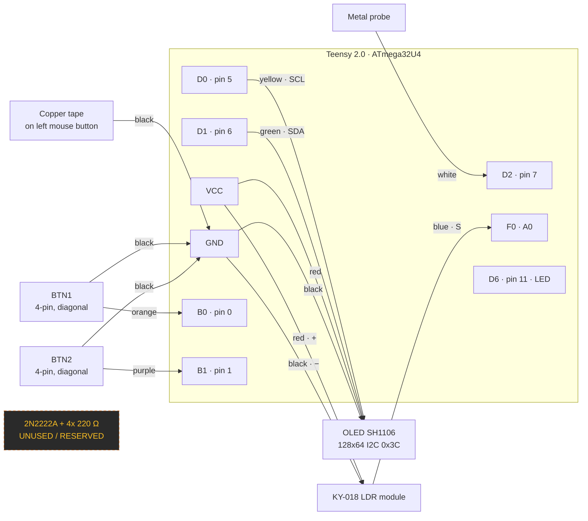

The 2N2222A and its resistor appear only to record that they exist and are **unused by the current
validated build**. No connection for them is invented here.

</details>

<details>
<summary><b>Bring-up — test in this order</b></summary>
<br>

Each step must pass before moving to the next.

| # | Step | Expected result |
|:--:|---|---|
| 1 | **Teensy alone.** Flash, open Serial Monitor at 115200 | `LATENCY_TESTER v1.5 OLED+LDR+BTN+PHOTON` then `READY`. **The Teensy does not reset when the monitor opens**, so send `V` if the banner has already scrolled past |
| 2 | **Probe.** Touch the probe to the copper tape | `TRIG` appears, pin-11 LED lights. Without the dashboard you then get `TIMEOUT:…` — that is correct |
| 3 | **OLED I²C scan** | Exactly one device at `0x3C` |
| 4 | **OLED display test** — `firmware/displayTester/` | Text on the panel; the main sketch prints `OLED_OK:0x3C` |
| 5 | **KY-018.** Send `L`, or read `LIGHT` in the Live tab | Covered ≈ **0–20**, evening room ≈ **150–250**, phone torch ≈ **1000**. If it does not move, the module is miswired |
| 6 | **All three together** | Probe still triggers; display refreshes ~2×/s. Occasional `SKIP:OLED_REFRESH` outside test mode is normal and correct |
| 7 | **Calibration** | `CALIB_OK:<offset>,…`. Lands near 250 µs — see the [known quirk](docs/serial_protocol.md#6-calibration-sequence) |
| 8 | **Test mode** | Overlay appears, `TESTMODE:ON`, OLED freezes, green ⇄ red tracks `ARMED`/`REARM` |
| 9 | **BTN1 / BTN2** | 10 presses → **exactly 10** events, no phantoms, no doubles, no repeat while held. Then BTN1 enters/leaves test mode and BTN2 clears the run outside it |
| 10 | **Probe-to-Photon** | Aim the KY-018 at the target, calibrate black then white, and check the separation is accepted. Then 10 presses → 10 `OPT:` samples |
| 11 | Transistor | 🚫 Nothing to do. The 2N2222A and the 220 Ω resistors stay out of the circuit |

Full detail with expected values: **[docs/wiring.md](docs/wiring.md)**.

</details>

<details>
<summary><b>Electrical notes</b></summary>
<br>

- **Disconnect USB before soldering.** No exceptions.
- **Never connect VCC directly to the probe signal.** `D2` is an input with an internal pull-up; it
  expects to be shorted to **GND** and nothing else.
- **All modules share a common GND.** Teensy, OLED, KY-018 and both buttons on the same rail.
- **Follow the printed `S` / `+` / `−` labels on the KY-018.** Do not deduce from pin position.
- **No external resistors on the buttons.** `INPUT_PULLUP` provides them; pull-downs break the logic.
- **Never modify the mouse.** No opening it, no soldering to its PCB, no transistor across its
  microswitch. Removable copper tape on the outside of the button is the only mouse-side change.
- **The 2N2222A and the 220 Ω resistor are unused/reserved** — not part of this build. If they are
  ever used, note that EBC and ECB pinouts both exist depending on package and manufacturer, so the
  exact part must be identified first.
- Measured supply on USB: **≈ 4.8 V**. Both the OLED and the KY-018 are fine at that level.

</details>

---

## Probe-to-Photon

A **second, separate** measurement mode, firmware **v1.5**. Probe-to-PC is untouched by it: the
probe ISR, the `TRIG`/`H` handshake, the serial calibration, the filters, the re-arm rules and the
OLED freeze are byte-identical to v1.4 and v1.3.

### What each mode measures

| | Probe-to-PC | Probe-to-Photon |
|---|---|---|
| **t₀** | Probe contact on `D2` | Probe contact on `D2` — **the same ISR** |
| **t₁** | The dashboard answers `H` over serial | The KY-018 on `A0` crosses the calibrated threshold |
| **Covers** | Mouse + link + polling + OS input stack | The above **plus** the app, the compositor, the GPU queue and the panel |
| **Serial round-trip subtracted** | Yes, `calibration_us` | **No** — nothing is transmitted between t₀ and t₁, so there is nothing to subtract |
| **Typical figure** | single-digit ms | tens of ms |
| **Status** | ✅ verified | 🧪 works, accuracy bounded by the sensor |

### How a run works

**You do not calibrate by hand.** The calibration happens inside the full-screen overlay, on the
same target the measurement uses — a baseline sampled anywhere else describes a different patch of
screen, with a different backlight, and is worthless.

1. **Live test → Measurement mode → Probe-to-Photon.** The optical panel appears.
2. **Aim the KY-018 at the centre of the screen**, where the full-screen target will appear. Two or
   three centimetres away, facing it square on. Tape or clamp it so it cannot drift.
3. **Press *Calibrate on the full-screen target*.** A centred full-screen target appears, paints
   itself black, waits 400 ms for the photoresistor to settle, samples `A0` — that is `dark` — then
   does the same in white for `bright`, shows the result and closes itself. Do not move the sensor
   while it runs; it takes about a second and a half. **Entering test mode repeats it automatically**,
   so the baselines always come from the run that is about to happen.
4. **The threshold is derived automatically**: the midpoint between the two. Direction is derived
   too, so a module whose ADC value *falls* as light rises works with no setting.
5. If the two baselines are less than **60 counts** apart the overlay stops at
   `CALIBRATION FAILED` and explains why. It never arms: a threshold inside the noise would make
   every sample a coin toss. Press <kbd>Esc</kbd>, fix the aim or the brightness, try again.
6. Otherwise the overlay hands over to the normal green/red/blue cycle with the black target in
   place. The instant Windows reports the click the target turns white; the Teensy has been sampling
   `A0` since the probe contact and stops at the first reading past the threshold.
7. Each sample arrives as `OPT:<ms>,raw:<adc>,…`. `raw` is the ADC value that tripped the threshold,
   kept per sample for debugging.

There is deliberately **one** calibration button and no way to sample a baseline anywhere except a
full-screen centred target: two readings from different parts of the screen describe different
patches of backlight, and a threshold built from them is worthless. To check the sensor is alive
without calibrating anything, watch the **LIGHT** field in the controls — it updates every second.

Guards, all of them deliberate: the target is a **plain label with no bindings**, so aiming the
sensor can never produce a click; a press with no calibration is refused with `OPT_ERR:NO_CAL`; a
target that is already white at t₀ is refused with `OPT_ERR:NOT_DARK` instead of returning a
near-zero time; and no transition inside **400 ms** ends in `OPT_TIMEOUT` rather than a hung
firmware.

### Read this before quoting a Probe-to-Photon number

> [!WARNING]
> **The KY-018 is a photoresistor, not an instrument.** A CdS cell's own response time is in the
> **milliseconds** — the same order of magnitude as the thing being measured — and it drifts with
> temperature and ambient light. Its contribution is inside every figure this mode reports and
> cannot be calibrated out.
>
> Use Probe-to-Photon to compare **one setup against itself**: same room, same panel, same sensor
> position, one variable changed. Do **not** publish the absolute value as a click-to-photon
> benchmark, and do not compare it against someone else's. Precision work needs a fast photodiode
> with a transimpedance amplifier.

Two smaller contributors, named so they are not mistaken for sensor error:

- **The dashboard's own repaint is inside the measurement.** The target is flipped by a 1 ms Tk
  poll, because touching a widget from the input-listener thread is not safe. That is honest —
  click-to-photon measures everything up to the photons, the application included — but it is
  a floor the method cannot go below.
- **The ADC runs faster in this mode.** The prescaler goes from /128 to /16 while the optical mode
  is active, so a reading costs ~13 µs instead of ~112 µs. It trades a little absolute accuracy for
  finer timing, which is the right way round for a threshold crossing.

Both modes are archived side by side and can be compared, but a comparison that **mixes** them says
so in the Compare tab: they do not measure the same interval, so a delta between them is not a
like-for-like figure.

---

## Firmware

| Sketch | Notes |
|---|---|
| `latency_tester/` | v1.0 — probe only |
| `latency_tester_oled_ldr/` | v1.1 — adds OLED + KY-018 |
| `latency_tester_oled_ldr_v1_2/` | v1.2 — adds `SKIP:OLED_REFRESH` |
| `latency_tester_oled_ldr_v1_3/` | v1.3 — debounce/re-arm, test mode, OLED freeze. **Measurement baseline** |
| `latency_tester_oled_ldr_v1_4/` | v1.4 — v1.3 plus BTN1/BTN2 events. Measurement path byte-identical to v1.3 |
| **`latency_tester_photon_v1_5/`** | **v1.5 — current. v1.4 plus Probe-to-Photon. The Probe-to-PC path is byte-identical to v1.4** |
| `displayTester/` | Standalone OLED check |

Older sketches still work; unknown tokens are logged, never dropped. Compatibility table in
[docs/serial_protocol.md](docs/serial_protocol.md).

---

## Repository layout

```
latency_tester/          the dashboard, as a package
  protocol.py            wire format, both modes, optical threshold maths
  constants.py           choice lists and the two measurement-mode ids
  stats.py               percentiles, MAD, outliers, deltas  (pure functions)
  database.py            SQLite archive + schema migrations
  serial_service.py      reader thread, TRIG/click association
  devices.py             mouse identification + report-rate measurement
  updater.py             checksum-verified one-click update
  demo.py                simulated Teensy, both measurement modes
  settings.py            persisted preferences
  i18n.py                translation loader
  locales/               one JSON file per language
  theme.py               light / dark / system palettes
  widgets.py             tooltips, metric cards, live chart
  export.py              CSV
  app.py                 shell, state, event pump
  views/                 live · sessions · compare · devices · preferences · testmode
firmware/                Arduino sketches, v1.0 → v1.5
packaging/               PyInstaller spec, Inno Setup script, build script
tests/                   pytest suite
docs/                    protocol, install, bring-up, first test, troubleshooting
legacy/                  the previous single-file dashboards, still runnable
```

The measurement and serial logic never imports tkinter, which is what lets it be tested headlessly.

## Development

```powershell
pip install -r requirements-dev.txt
python -m pytest tests -q
```

**293 tests**, **88% coverage of the non-GUI code** — the GUI is deliberately excluded rather than
padded with tests that assert nothing. CI enforces the coverage floor, so the badge cannot drift
down silently.

Covered: protocol parsing including the button tokens, the firmware button-debounce rules,
statistics and percentiles, the database and its migrations, run save/load/duplicate, CSV export,
settings, every locale, the updater's checksum verification and host allow-listing, mouse naming
rules and the polling-rate formula, the TRIG↔click association, and the demo device.

`tests/test_button_debounce.py` mirrors `serviceButtons()` / `flushButtonEvents()` from the v1.4
sketch line for line, so the bench acceptance rules are checked in CI. It is a **mirror, not an
import**: if the `.ino` changes, change the test too.

`tests/test_button_actions.py` is the opposite: it calls the dashboard's real button dispatcher on a
stub, so the refusal rules (disconnected, calibrating, `BTN2` during test mode, the confirmation
preference) are checked without needing a window.

`tests/test_photon.py` covers Probe-to-Photon end to end short of the hardware: the `OPT:` wire
format and that it can never decode as a `LAT:` one, the threshold maths including a sensor whose
value falls with light, the refusal when the two baselines are too close, and the schema-3
migration of an existing archive.

### Building the installer

```powershell
powershell -ExecutionPolicy Bypass -File packaging\build_installer.ps1
```

Requires [Inno Setup 6](https://jrsoftware.org/isdl.php). The script runs the tests first and
refuses to build if anything fails, then emits the installer and its SHA-256 into
`build\installer\`.

---

## Contributing

Pull requests are welcome. [CONTRIBUTING.md](CONTRIBUTING.md) covers setup, testing rules and how to
add a language — the last of which needs no Python and is the easiest place to start.

One rule matters above the others: **changes to the measurement pipeline need before/after
numbers**, not opinions. Everything else is fair game.

Security issues go through
[private reporting](https://github.com/PrimeBuild-pc/MouseLatencyTester/security/advisories/new),
never a public issue — see [SECURITY.md](SECURITY.md).

## Support the project

If MouseLatencyTester is useful to you, you can support its development here:

[](https://paypal.me/PrimeBuildOfficial?country.x=IT&locale.x=it_IT)

## Privacy

No telemetry, no analytics, no background network activity. Every measurement stays in a local
SQLite file under your Documents folder. The only network request the app ever makes is the update
check, and only when **you** press the button.

## Licence

[MIT](LICENSE) © 2026 PrimeBuild.

<div align="center">
<sub>Built around a Teensy 2.0 (PJRC), with <code>pyserial</code>, <code>pynput</code> and <code>matplotlib</code>.</sub>
</div>
